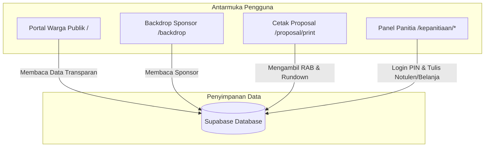

# Dokumentasi Sistem: Proyek HUT RI 81 RT 12 Pelem Kidul

Selamat datang di repositori dokumentasi teknis terpusat untuk aplikasi web koordinasi dan transparansi warga RT 12 Pelem Kidul dalam menyambut peringatan HUT RI Ke-81 tahun 2026.

Dokumentasi ini dirancang secara modular agar mudah dibaca oleh pengembang manusia maupun dipahami secara cepat oleh agen AI pengembang (AI Agents) di masa mendatang.

---

## 📂 Struktur Dokumen Sistem

Dokumentasi dibagi ke dalam file-file spesifik berikut untuk menjelaskan masing-masing subsistem:

1. **[DATABASE_SCHEMA.md](file:///k:/Personal/RT12/HutRi81/app/docs/system/DATABASE_SCHEMA.md)**
   * Menjelaskan struktur 8 tabel database Supabase, kamus data, tipe data, relasi (foreign keys), serta kebijakan keamanan Row Level Security (RLS) yang diterapkan.
   
2. **[FINANCE_FLOWS.md](file:///k:/Personal/RT12/HutRi81/app/docs/system/FINANCE_FLOWS.md)**
   * Menjelaskan logika pelacakan keuangan, hubungan antara anggaran terencana (RAB) dengan realisasi pengeluaran riil di lapangan, serta audit pembelanjaan panitia.
   
3. **[SPONSORSHIP_BACKDROP.md](file:///k:/Personal/RT12/HutRi81/app/docs/system/SPONSORSHIP_BACKDROP.md)**
   * Menjelaskan pengelompokan kasta sponsor (Platinum, Gold, Silver, Donatur Warga) serta logika penataan ukuran nama/logo sponsor pada visualizer backdrop panggung.
   
4. **[AI_DEVELOPER_GUIDE.md](file:///k:/Personal/RT12/HutRi81/app/docs/system/AI_DEVELOPER_GUIDE.md)**
   * Panduan orientasi pengembang cepat yang merinci arsitektur Next.js, penanganan fallback offline, sistem autentikasi berbasis PIN panitia, dan sistem pencatatan perubahan (Audit Logging).

---

## 🏛️ Arsitektur Sistem Global

Aplikasi ini menggunakan Next.js (App Router) sebagai kerangka kerja frontend dan Supabase sebagai backend database real-time.

* **Public Portal**: Berfungsi sebagai antarmuka warga umum yang menyajikan visualisasi data tanpa informasi sensitif.
* **Back Office**: Panel manajemen panitia terproteksi PIN untuk pembaruan data secara real-time yang langsung tercermin pada halaman publik.
